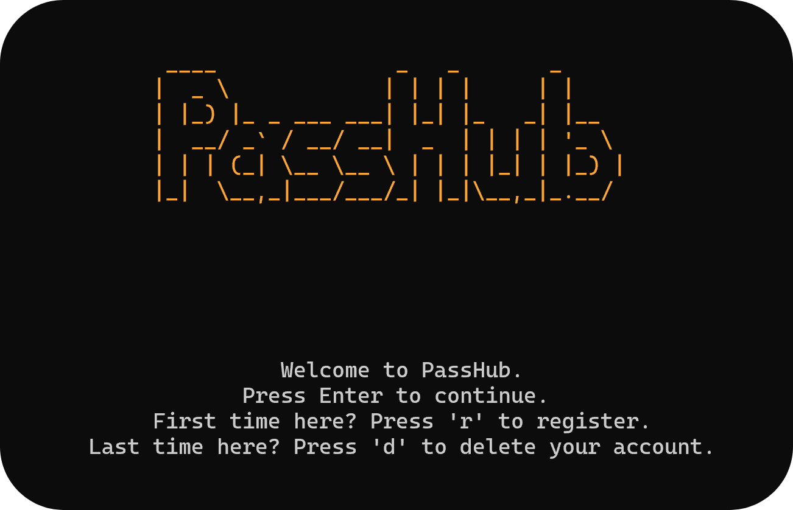
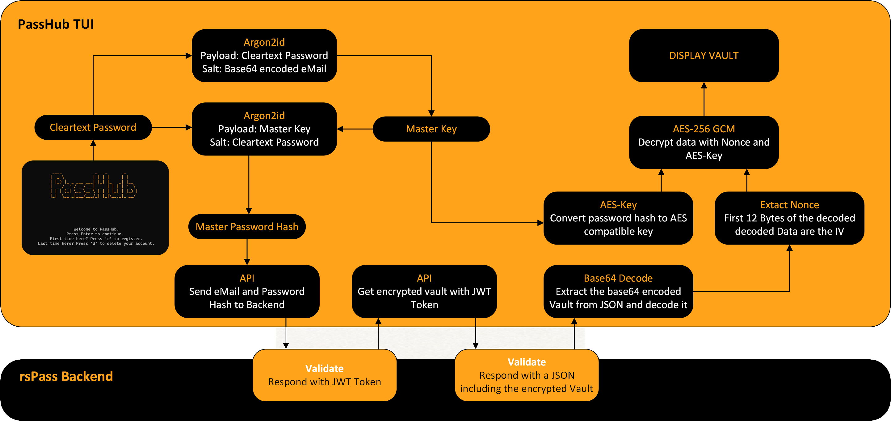
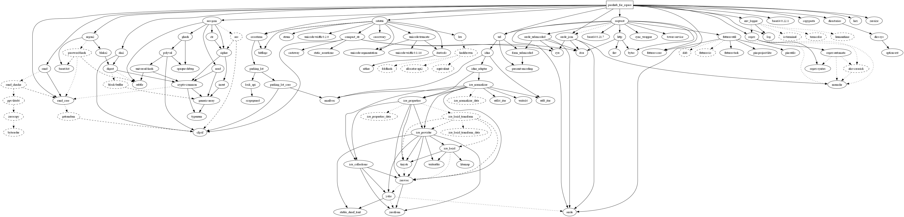

# PassHub CLI 🦀


[](https://github.com/Sir-Eddy/PassHub/actions/workflows/rust.yml)


PassHub is a user-friendly Command-Line Interface (CLI) application for accessing and managing passwords in the rsPass backend. The CLI uses the Rust library `ratatui` to provide an intuitive, terminal-based user interface.



## Features

**Password Management**  
Access your passwords, create new entries, and edit or delete existing ones in your rsPass backend.

**Account Creation**  
Create a new account directly through the CLI—no prior account is required.

**Intuitive User Interface**  
Leverages a terminal-based interface provided by `ratatui` for easy and interactive navigation.

**Integration with rsPass**  
Seamlessly communicate with your rsPass backend secured via HTTPS.

## Security



## Requirements

**Running rsPass Backend Server**  
The rsPass backend must be installed, configured, and accessible. Refer to the [rsPass backend repository](https://github.com/Letgamer/rsPass) for setup instructions.

## Installation

1. **Download the CLI**  
   Visit the [Releases](https://github.com/Sir-Eddy/PassHub/releases) page and download the appropriate binary for your operating system:  
   - **Linux**: `passhub_for_rspass_linux`  
   - **Windows**: `passhub_for_rspass_windows.exe`

2. **Set Executable Permissions (Linux only)**  
   After downloading the Linux binary, make it executable by running:  
   ```bash
   chmod +x passhub_for_rspass_linux
   ```

3. **Run the Application**  
   Execute the downloaded binary:  
   - On Linux:  
     ```bash
     ./passhub_for_rspass_linux
     ```
   - On Windows:  
     ```cmd
     passhub_for_rspass_windows.exe
     ```

4. **First-Time Configuration**  
   - **Set Backend URL**: On the first launch, you will be prompted to enter the URL of your rsPass backend.  
   - **Register**: Create a new account to start using the CLI.

## Configuration

1. **Set the Backend URL**  
   On first launch, the CLI will prompt you to enter the URL of your rsPass backend.

2. **Login / Register**  
   Provide your credentials or create a new account to obtain a JWT, which will be stored in main memory on runtime.

## Dependencies



## Support

If you have any questions or issues, please open an issue in the [GitHub Repository](https://github.com/Sir-Eddy/PassHub/issues).
